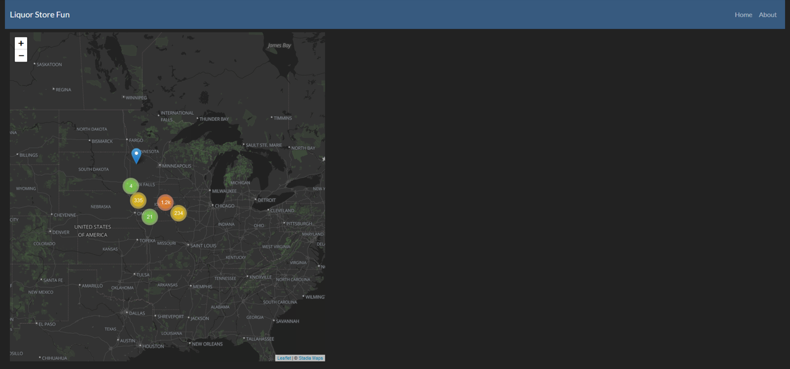

# What is this about?

This is the repository for the plotly [dash community challenge](https://community.plotly.com/t/autumn-community-app-challenge/66996) of fall 2022

I created a multi page app for learning purposes and having fun during the development. <br>
I am pretty happy with the result considering the time I had. I learned a lot and have some<br>
ideas to improve the app. <br>

In order to run the app locally, please create a virtual environment with the provided ```requirements.txt```.
Then simply run ``app.py``, open your browser and go to ``http://127.0.0.1:8050/``.

You should see this:




